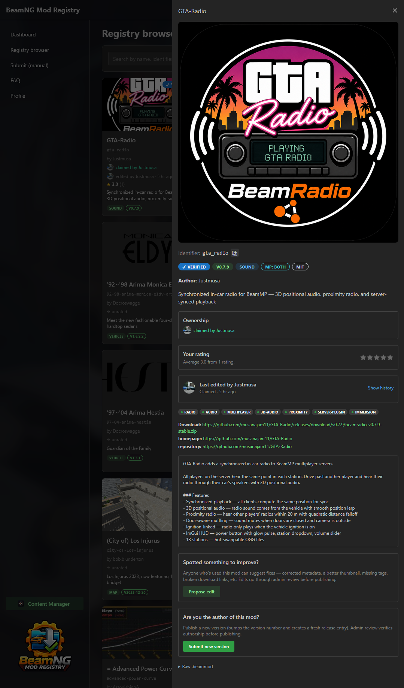
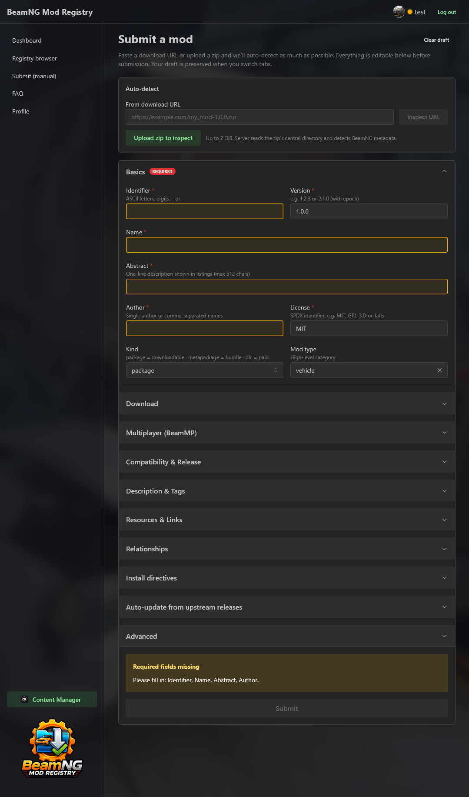
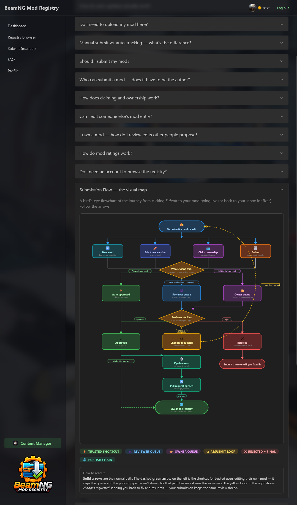
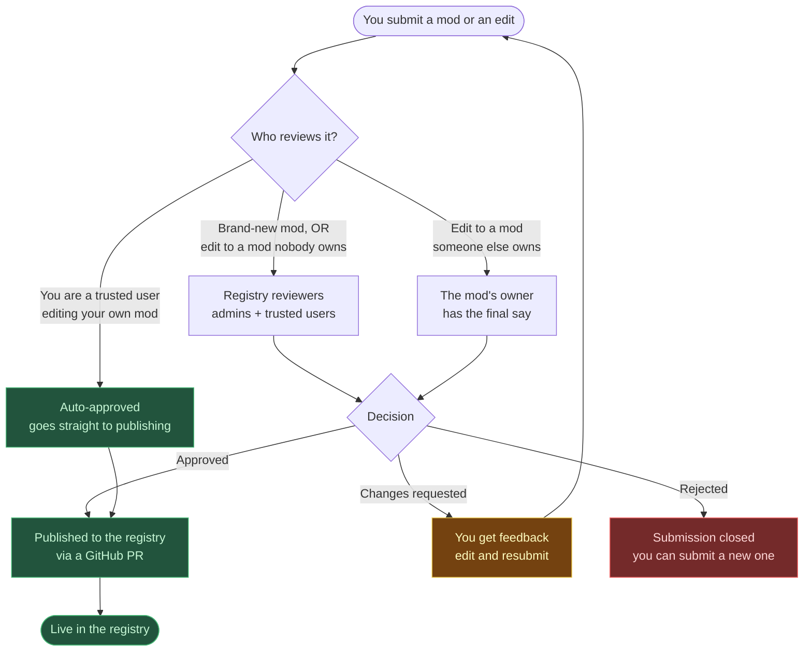

<p align="center">
  
</p>

<p align="center">
  <a href="https://bmr.musanet.xyz">
    
  </a>
</p>

<p align="center">
  <strong>The hosted submission portal & registry browser</strong><br>
  <a href="https://bmr.musanet.xyz"><code>bmr.musanet.xyz</code></a>
</p>

# BeamNG Mod Registry

A CKAN-inspired mod metadata repository for BeamNG.drive and BeamMP mods.

## A Look at the Registry

<table>
  <tr>
    <td align="center" width="33%">
      <a href="assets/registryexpanded.png">
        
      </a>
      <br><sub><b>Browse & Discover</b><br>Search, filter, rate, and inspect every mod in one place.</sub>
    </td>
    <td align="center" width="33%">
      <a href="assets/submit.png">
        
      </a>
      <br><sub><b>Submit in Minutes</b><br>Paste a URL or drop a zip — fields auto-detect from the archive.</sub>
    </td>
    <td align="center" width="33%">
      <a href="assets/faq.png">
        
      </a>
      <br><sub><b>Transparent Workflow</b><br>Built-in FAQ and visual submission map — no guesswork.</sub>
    </td>
  </tr>
</table>

## Submission Flow



> Full breakdown of every state, the ownership model, and trust tiers lives in [docs/submission-flow.md](docs/submission-flow.md).

## Frequently Asked Questions

<details>
<summary><strong>What is the BeamNG Mod Registry?</strong></summary>

It's a community-curated **metadata index** for BeamNG.drive and BeamMP mods, modeled after the CKAN system used by Kerbal Space Program. Each entry is a small JSON file (a `.beammod`) describing *where* a mod lives, what version is current, what kind of content it is, what it depends on, and how to verify the file (SHA-256 hash + size).

The registry itself does **not** host any mod files — the author keeps full control of where the mod is hosted (BeamNG.com, GitHub releases, their own site, etc.). Think of it as a phone book that points to the original source.

The full index is published as a single compressed JSON artifact to GitHub Releases. Compatible launchers download that artifact and use it to browse, install, update, and resolve dependencies.
</details>

<details>
<summary><strong>What's the benefit over just downloading mods manually?</strong></summary>

- **Auto-updates.** Compatible launchers (e.g. BeamMP Content Manager) read the registry and notice when a mod has a new version, then download it for you.
- **Integrity checks.** Every entry can carry a SHA-256 hash and expected file size, so a launcher verifies the downloaded file hasn't been tampered with.
- **Dependencies resolved automatically.** Entries declare required, recommended, suggested, and conflicting mods; the launcher installs the whole tree in one go.
- **Single stable identifier.** Mod packs and BeamMP servers can reference one identifier instead of hard-coded download links that break.
- **Discoverability.** Browse, search, and filter mods in one place rather than hunting forum threads.
</details>

<details>
<summary><strong>How do auto-updates actually work?</strong></summary>

1. A registry entry stores the mod's current `version`, `download` URL, and `download_hash.sha256`.
2. When the author releases a new version, the entry is updated — either **automatically** (if it has a `$kref` auto-tracking template) or **manually** via a new web submission.
3. That update is committed to the registry repository, which triggers CI to rebuild and publish a new compressed index to GitHub Releases.
4. Your launcher periodically fetches the latest index, compares the stored version against your installed version, and if there's a newer one, downloads it from the original URL and verifies the SHA-256 before installing.
</details>

<details>
<summary><strong>Do I need to upload my mod file here?</strong></summary>

**No.** The mod file itself is never stored on this server. You submit metadata (name, version, download URL, hash, type, tags, dependencies, etc.) and the file stays on whatever host you already use.

You *can* upload your `.zip` on the submit page, but only so the server can read the archive's table of contents and pre-fill fields for you (file count, mod type detection, server vs client layout, suggested name from `info.json`). Nothing about that upload is kept after inspection.
</details>

<details>
<summary><strong>Manual submit vs. auto-tracking — what's the difference?</strong></summary>

There are two ways an entry can stay up to date:

- **Manual.** You submit a fresh metadata entry every time you release a new version. Good if your mod doesn't live on GitHub or you only ship occasional releases.
- **Auto-tracking (NetBeamMod).** You submit a tiny template that points at a source — either a GitHub repo (`#/github/owner/repo`) or a BeamNG.com resource (`#/beamng/12345`). A scheduled job watches that source, and whenever a new release appears it automatically generates a new `.beammod` entry with the version, download URL, and freshly computed hash. You never have to touch the registry again.

Auto-tracking templates support optional knobs: `$filter_asset` (regex to pick the right release asset), `$version_strip_v`, `$version_transform`, `$include_prerelease`, and `$max_releases`.
</details>

<details>
<summary><strong>Should I submit my mod?</strong></summary>

Submit if you want any of these:

- Players to get auto-updates when you release new versions.
- A stable, hash-verified link you can share or use in mod packs.
- Your mod listed in tools and servers that read the registry.
- Dependency resolution to handle prerequisites for you.

If your mod is private, work-in-progress, or you don't want it redistributed via tooling, just don't submit it.
</details>

<details>
<summary><strong>How does claiming and ownership work?</strong></summary>

Many mods are auto-imported from BeamNG.com with minimal metadata and appear as **unverified**. If you're the original author, you can claim a mod to gain ownership and the **Registry Verified** badge.

- Claiming requires reviewer approval — reviewers will check the source / repo / forum thread to confirm you're the real author.
- Once you own a mod, **you become the reviewer** for any edits other users submit to it. They show up in your dashboard's *Mods you own* section with a "pending review" badge.
- You can give up ownership at any time. Pending reviews on the mod fall back to the registry reviewer queue.
</details>

<details>
<summary><strong>Do I need an account to browse the registry?</strong></summary>

No. The registry browser and FAQ are publicly readable. Anyone can search, filter, open mod details, and view the average rating, owner, and edit history without signing in.

Sign-in is required only for actions that change state: rating a mod, claiming a mod, proposing an edit, or submitting a new version.
</details>

<details>
<summary><strong>Where do mod files actually live?</strong></summary>

On whatever host the author chose — typically the BeamNG.com repository, GitHub releases, or another file host on the allowlist. This site never stores the binaries themselves. The only data on the server is metadata, accounts, submissions, audit logs, and cached thumbnails.
</details>

<details>
<summary><strong>What changes based on my trust level?</strong></summary>

| You are… | New mod or your own mod | Editing someone else's mod | Claiming a mod |
|---|---|---|---|
| **New / untrusted user** | Goes to reviewer queue | Goes to the owner's queue (or reviewer queue if unowned) | Goes to reviewer queue |
| **Trusted user / admin** | Auto-approved, publishes immediately | Still goes to the owner — owners always get final say | Goes to reviewer queue |
| **Owner of the mod being edited** | Auto-approved (if you're trusted) | n/a — you're the owner | n/a — already yours |

Trust is earned: after a few clean approved submissions, reviewers can upgrade your account so future edits skip the queue.
</details>

---

## How It Works

This repository contains `.beammod` metadata files — one per mod version — organized by identifier. The BeamMP Content Manager downloads a compressed index from GitHub Releases and uses it for mod browsing, installation, dependency resolution, and update checking.

**No domain or server required.** Everything runs on GitHub infrastructure:

| Component | GitHub Feature |
|-----------|---------------|
| Metadata storage | This repository |
| Compressed index | GitHub Releases |
| Validation | GitHub Actions |
| Community contributions | Pull Requests |

## Repository Structure

```
netbeammod/                              ← inflator templates (one per mod)
├── gta_radio.netbeammod
└── drift_tires_pack.netbeammod
mods/                                    ← generated/manual .beammod files
├── drift_tires_pack/
│   └── drift_tires_pack-1.0.0.beammod
├── realistic_suspension/
│   ├── realistic_suspension-2.1.0.beammod
│   └── realistic_suspension-2.2.0.beammod
└── track_day_modpack/
    └── track_day_modpack-1.0.0.beammod     (kind: metapackage)
schema/
├── beammod.schema.json
└── netbeammod.schema.json
scripts/
├── validate.mjs
├── build-index.mjs
├── inflate.mjs                          ← NetBeamMod inflator
└── verify-downloads.mjs                 ← download & hash verification
```

## Automated Mod Tracking (NetBeamMod)

For mods hosted on GitHub, you can submit a small `.netbeammod` template instead of writing `.beammod` files by hand. The **inflator** (inspired by [CKAN's NetKAN](https://github.com/KSP-CKAN/NetKAN)) automatically:

1. Monitors your GitHub releases for new versions
2. Downloads the release asset and computes SHA256 + file size
3. Generates a complete `.beammod` metadata file
4. Commits it to the registry — triggering the index build pipeline

**Example template** (`netbeammod/my_mod.netbeammod`):

```json
{
  "spec_version": 1,
  "identifier": "my_mod",
  "$kref": "#/github/username/my-mod-repo",
  "$filter_asset": "my-mod-.*\\.zip$",
  "name": "My Mod",
  "abstract": "A great mod",
  "author": "You",
  "license": "MIT",
  "tags": ["vehicle"]
}
```

This replaces hundreds of lines of manual metadata per release with a single ~10-line template. See [CONTRIBUTING.md](CONTRIBUTING.md) for the full guide.

## The `.beammod` Format

A `.beammod` file is a JSON document (UTF-8) describing a single version of a mod. Named as `{identifier}-{version}.beammod`.

### Example

```json
{
  "spec_version": 1,
  "identifier": "drift_tires_pack",
  "name": "Drift Tires Pack",
  "abstract": "High-grip drift tires for all vehicles",
  "author": "TireMaster",
  "version": "1.0.0",
  "license": "MIT",
  "mod_type": "vehicle",
  "download": "https://example.com/drift_tires_pack-1.0.0.zip",
  "download_hash": { "sha256": "abc123..." },
  "download_size": 524288,
  "beamng_version_min": "0.31",
  "tags": ["tires", "drift", "physics"],
  "depends": [
    { "identifier": "wheel_physics_framework", "min_version": "1.0" }
  ],
  "supports": [
    { "identifier": "drift_king_vehicle" }
  ],
  "install": [
    { "find": "drift_tires", "install_to": "mods/repo" }
  ],
  "resources": {
    "homepage": "https://beamng.com/resources/drift-tires-pack.12345/",
    "repository": "https://github.com/tiremaster/drift-tires"
  }
}
```

### Required Fields

| Field | Description |
|-------|-------------|
| `spec_version` | Integer `1` (current spec) |
| `identifier` | Unique ID: ASCII letters, digits, hyphens, underscores (2–128 chars) |
| `name` | Human-readable name |
| `abstract` | One-line description (max 512 chars) |
| `author` | Author name or array of names |
| `version` | Version string, e.g. `"1.2.3"` or `"2:1.0"` (epoch prefix) |
| `license` | SPDX license identifier(s) |

### Optional Fields

| Field | Type | Description |
|-------|------|-------------|
| `kind` | string | `"package"` (default), `"metapackage"`, or `"dlc"` |
| `download` | string / string[] | URL(s) to the mod archive. Required for `kind: "package"` |
| `download_hash` | object | `{ "sha256": "..." }` — verified on install |
| `download_size` | integer | Archive size in bytes |
| `install_size` | integer | Installed size in bytes |
| `mod_type` | string | `vehicle`, `map`, `skin`, `ui_app`, `sound`, `license_plate`, `scenario`, `automation`, `other` |
| `tags` | string[] | Categorization tags (unique) |
| `description` | string | Long-form Markdown description (max 16KB) |
| `release_status` | string | `stable`, `testing`, `development` |
| `release_date` | string | ISO date (e.g. `"2026-04-05"`) |
| `beamng_version` | string | Exact game version or `"any"` |
| `beamng_version_min` | string | Minimum game version (inclusive) |
| `beamng_version_max` | string | Maximum game version (inclusive) |
| `beammp_version_min` | string | Minimum BeamMP version required |
| `multiplayer_scope` | string | `"client"` (default), `"server"`, or `"both"` — see [Multiplayer Scope](#multiplayer-scope) |
| `server_download` | string / string[] | URL(s) to the server plugin archive (dual-component mode) |
| `server_download_hash` | object | `{ "sha256": "..." }` — verified on server plugin install |
| `$kref` | string | Source reference for auto-tracking: `#/github/{owner}/{repo}` or `#/beamng/{id}` |
| `comment` | string | Internal note (not displayed to users, max 4KB) |
| `localizations` | object | Localized strings — see [Localizations](#localizations) |
| `thumbnail` | string | Preview image URL |
| `resources` | object | External links (`homepage`, `repository`, `bugtracker`, `beamng_resource`, `beammp_forum`) |

### Relationships

| Field | Behavior |
|-------|----------|
| `depends` | Hard dependencies — must be installed |
| `recommends` | Installed by default, user can decline |
| `suggests` | Not installed by default, user can opt-in |
| `supports` | Mods this enhances when present (informational, reverse of `suggests`) |
| `conflicts` | Cannot coexist with these mods |
| `provides` | Virtual package names this mod satisfies |
| `replaced_by` | Pointer to successor mod |

```json
"depends": [
  { "identifier": "some_mod" },
  { "identifier": "other_mod", "min_version": "2.0", "max_version": "3.0" },
  { "any_of": [
    { "identifier": "option_a" },
    { "identifier": "option_b" }
  ], "choice_help_text": "Pick your preferred option" }
]
```

### Install Directives

Control how mod contents are extracted and placed. Each directive must specify one of `file`, `find`, or `find_regexp` along with `install_to`.

| Field | Description |
|-------|-------------|
| `file` | Exact path within the archive |
| `find` | Directory name to locate (case-insensitive) |
| `find_regexp` | Regex to locate in the archive |
| `install_to` | Target: `"mods"`, `"mods/repo"`, or a subdirectory |
| `as` | Rename the matched directory/file during install |
| `filter` | Filename(s) to exclude |
| `filter_regexp` | Regex pattern(s) to exclude |
| `include_only` | Whitelist: only install files matching these names |
| `include_only_regexp` | Whitelist: only install files matching these patterns |
| `find_matches_files` | When `true`, `find`/`find_regexp` can match files, not just directories |

```json
"install": [
  {
    "find": "vehicles",
    "install_to": "mods/repo",
    "filter": ["thumbs.db", ".gitkeep"],
    "include_only_regexp": ["\\.zip$"]
  }
]
```

### Multiplayer Scope

BeamMP multiplayer mods have separate client and server components:

- **Client mod**: Standard BeamNG `.zip` → installed to `mods/repo/`
- **Server plugin**: Lua scripts using the BeamMP server API → installed to the server's `Resources/Server/<modname>/`

| Value | Meaning |
|-------|---------|
| `"client"` (default) | Standard BeamNG client mod only |
| `"server"` | BeamMP server plugin only (installs to `Resources/Server/`) |
| `"both"` | Has both client and server components |

For `"both"`, two distribution models are supported:

**Outer-zip layout** — single download with a `Resources/` directory structure:
```
Resources/Client/my_mod.zip    → extracted to mods/repo/
Resources/Server/my_mod/       → extracted to server's Resources/Server/
```

**Dual-component** — separate `server_download` field for the server plugin:
```json
{
  "multiplayer_scope": "both",
  "download": "https://example.com/client_mod.zip",
  "download_hash": { "sha256": "..." },
  "server_download": "https://example.com/server_plugin.zip",
  "server_download_hash": { "sha256": "..." }
}
```

The Content Manager auto-detects the `Resources/` layout in the main download. If no `Resources/` layout is found and no `server_download` is set, only the client component is installed.

### Localizations

Provide translated strings keyed by locale code:

```json
"localizations": {
  "de": {
    "name": "Drift-Reifen-Paket",
    "abstract": "Hochleistungs-Drift-Reifen für alle Fahrzeuge"
  },
  "fr": {
    "name": "Pack de Pneus Drift",
    "abstract": "Pneus drift haute performance pour tous les véhicules"
  }
}
```

Each locale can override `name`, `abstract`, and/or `description`.

### Extension Fields

Fields prefixed with `x_` are allowed for third-party tooling and are ignored by the official schema validation:

```json
{
  "x_my_tool_setting": "value",
  "x_custom_tags": ["competitive", "ranked"]
}
```

The registry uses one built-in extension field:

| Field | Type | Description |
|-------|------|-------------|
| `x_verified` | boolean | `true` for manually-curated GitHub-sourced entries, `false` for auto-scraped BeamNG.com entries. Set automatically by the inflator based on `$kref` source. |

Verified mods display a **Registry Verified** badge in the Content Manager and are sorted above unverified entries.

## For Mod Authors

See [CONTRIBUTING.md](CONTRIBUTING.md) for the full submission guide.

### Submit via the Web UI (easiest)

The registry has a hosted submission portal that handles everything for you — no Git, no JSON, no PRs.

**➤ [bmr.musanet.xyz](https://bmr.musanet.xyz)**

1. Sign up with email (Cloudflare Turnstile-protected)
2. Paste a download URL **or** upload a `.zip` directly — metadata is auto-detected from the archive
3. Review the auto-filled fields, edit anything, and submit
4. Submissions enter an admin review queue and, once approved, are committed to this repo automatically

Drafts are preserved across tabs and you can edit existing entries to publish new versions.

### Quick Start (Git/PR workflow)

**Automated (recommended):** Submit a `netbeammod/{id}.netbeammod` template with a `$kref` — the inflator handles everything after that.

**Manual:**
1. Fork this repository
2. Create `mods/{your_mod_id}/{your_mod_id}-{version}.beammod`
3. Fill in the metadata (see example above)
4. Open a Pull Request
5. GitHub Actions validates metadata, cross-checks dependencies, and verifies downloads
6. Once merged, your mod appears in the BeamMP Content Manager

### Claiming an Auto-Scraped Mod

Many mods are auto-imported from BeamNG.com with minimal metadata and appear as **unverified**. If you're the original author, you can claim your mod to get the **Registry Verified** badge:

1. Find your mod's `.netbeammod` template in `netbeammod/`
2. Change `$kref` from `#/beamng/{id}` to `#/github/{you}/{your-repo}`
3. Fill in proper license, tags, and description
4. Open a Pull Request

The inflator automatically prefers GitHub sources over BeamNG when duplicate identifiers exist. See the [Claiming guide in CONTRIBUTING.md](CONTRIBUTING.md#claiming-an-auto-scraped-mod) for full details.

### Embedding Metadata

You can also include a `.beammod` file inside your mod zip. The Content Manager will detect and use it as the authoritative metadata source.

## For Developers

### Building the Index

The GitHub Actions pipeline automatically:
1. **Validates** all `.beammod` files against the JSON Schema + cross-validates dependencies
2. **Verifies downloads** on PRs — fetches each URL, confirms SHA256 hash matches
3. **Builds** a compressed index (`registry-index.json.gz`)
4. **Uploads** it as a GitHub Release

The **inflator** runs daily (or on-demand) to check for new upstream releases and auto-opens PRs when new versions are found.

### Local Development

```bash
# Install dependencies
npm install

# Validate all metadata files (schema + dependency cross-validation)
npm run validate

# Build the index locally
npm run build

# Run inflator (dry-run — preview only)
npm run inflate:dry

# Run inflator (generate .beammod files from templates)
GITHUB_TOKEN=ghp_... npm run inflate

# Regenerate all .beammod files (even existing ones)
GITHUB_TOKEN=ghp_... node scripts/inflate.mjs --force

# Verify all download URLs and SHA256 hashes
npm run verify

# Auto-fix hashes and sizes from actual downloads
npm run verify:fix
```

## License

[MIT](LICENSE)
